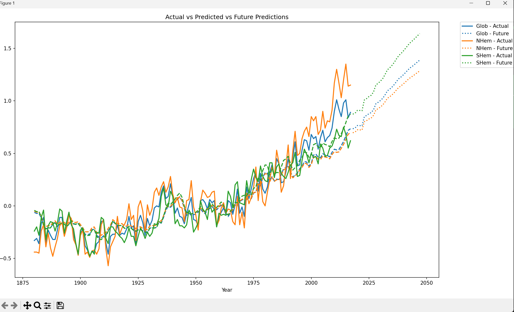
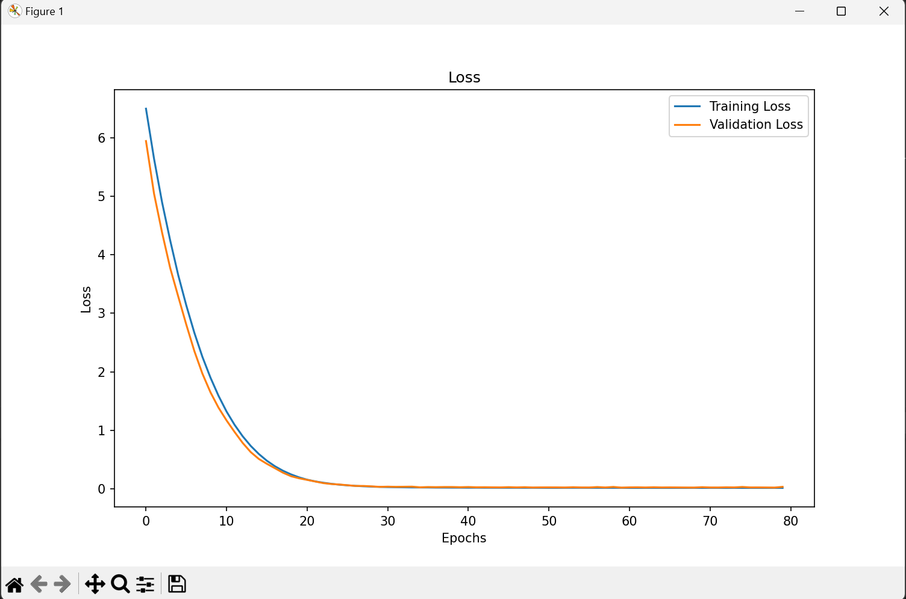

This repo contains an AI model (LSTM) for prediction of long-term climate trends. It is trained on the [NASA Zonal Annual Means](https://data.giss.nasa.gov/gistemp/tabledata_v3/) dataset.

### Results

### How to use
1. Ensure you have Python >=3.11.4 and virtualenv installed on your computer.
2. Fetch the project, navigate to the root directory and create a virtual environment: `virtualenv env`
3. Activate the virtual enviroment: `.\venv\Scripts\activate` (Windows), `source venv/bin/activate` (macOS and Linux)
4. Install required dependencies: `pip install -r requirements.txt` and you're ready to run the project.